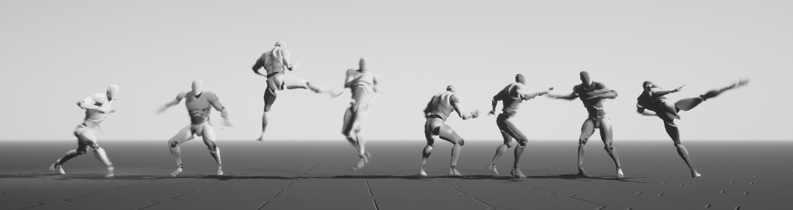

# Learning Time-Critical Responses for Interactive Character Control


## Abstract

This code implements the paper [Learning Time-Critical Responses for Interactive Character Control](http://mrl.snu.ac.kr/research/ProjectAgile/Agile.html).
This system implements teacher-student framework to learn time-critically responsive policies, which guarantee the time-to-completion between user inputs and their associated responses regardless of the size and composition of the motion databases.
This code is written in java and Python, based on [Tensorflow2](https://github.com/tensorflow/tensorflow). 

## Publications

Kyungho Lee, Sehee Min, Sunmin Lee, and Jehee Lee. 2021. Learning Time-Critical Responses for Interactive Character Control. ACM Trans. Graph. 40, 4, 147. (SIGGRAPH 2021)

Project page: http://mrl.snu.ac.kr/research/ProjectAgile/Agile.html

Paper: http://mrl.snu.ac.kr/research/ProjectAgile/AGILE_2021_SIGGRAPH_author.pdf

Youtube: https://www.youtube.com/watch?v=rQKuvxg5ZHc

# How to install
This code is implemented with Java and Python, and was developed using Eclipse on Windows.
A Windows 64-bit environment is required to run the code.

## Requirements

**Install JDK 1.8**

[Java SE Development Kit 8 Downloads](https://www.oracle.com/java/technologies/javase/javase-jdk8-downloads.htm)

**Install Eclipse**

[Install Eclipse IDE for Java Developers](https://www.eclipse.org/downloads/)

**Install Python 3.6**

https://www.python.org/downloads/release/python-368/

**Install pydev to Eclipse**

https://www.pydev.org/download.html

**Install cuda and cudnn 10.0**

[CUDA Toolkit 10.0 Archive](https://developer.nvidia.com/cuda-10.0-download-archive)

[NVIDIA cuDNN](https://developer.nvidia.com/cudnn)

**Install Visual C++ Redistributable for VS2012**

Laplacian Motion Editing(``PmQmJNI.dll``) is implemented in C++, and VS2012 is required to run it.

[Visual C++ Redistributable for Visual Studio 2012 Update 4](https://www.microsoft.com/en-us/download/details.aspx?id=30679)

**Install JEP(Java Embedded Python)**

[Java Embedded Python](https://github.com/ninia/jep)

This library requires a part of the Visual Studio installation.
I don't know exactly which ones are needed, but I'm guessing ``.net framework 3.5``, ``VC++ 2015.3 v14.00(v140)``. Installing Visual Studio 2017 or later may be helpful.

**Install Tensoflow 1.14.0**

```bash
pip install tensorflow-gpu==1.14.0
```

## Install this repository

We recommend downloading through Git in Eclipse environment.

1. Open Git Perspective in Elcipse
2. Paste repository url and clone repository ( 'https://git.ncsoft.net/scm/private_khlee/private-khlee-test.git' )
3. Select all projects in ``Working Tree``
4. Right click and select ``Import Projects``, and ``Import existing Eclipse projects``.

Or you can just download the repository as Zip file and extract it, and import it using ``File->Import->General->Existing Projects into Workspace`` in Eclipse.

### Install third party library

This code uses [Interactive Character Animation by Learning Multi-Objective Control](https://github.com/snumrl/InteractiveAnimation) for learning the student policy.

Download required third pary library files([ThirdPartyDlls.zip](https://github.com/snumrl/InteractiveAnimation/raw/master/ThirdPartyDlls.zip)) and extract it to ``mrl.motion.critical`` folder.   


# Dataset
The entire data used in the paper cannot be published due to copyright issues.
This repository contains only minimal motion dataset for algorithm validation.
[SNU Motion Database](http://mrl.snu.ac.kr/mdb/all-sessions) was used for martial arts movements,
[CMU Motion Database](http://mocap.cs.cmu.edu/) was used for locomotion.

# How to run

## Eclipse
All of the instructions below are assumed to be executed based on Eclipse. Executable java files are grouped in package ``mrl.motion.critical.run`` of project ``mrl.motion.critical``.
+ You can directly open source file with ``Ctrl+Shift+R``
+ You can run the currently open source file with ``Ctrl+F11``.
+ You can configure program arguments in ``Run->Run Configurations`` menu.

## Pre-trained student policy
You can see the pre-trained network by running ``RuntimeMartialArtsControlModule.java``.
Pre-trained network file is located at ``mrl.python.neural\train\martial_arts_sp_da``

+ ``1, 2`` : walk, run
+ ``3,4,5,6`` : martial arts actions
+ ``q,w,e,r,t`` : control critical response time

## How to train
1. Data Annotation & Configuration
    + You can check motion data list and annotation information by executing ``MAnnotationRun.java``.
1. Model Configuration
    + Action list, critical response time of each action, user input model and error metric is defined at ``MartialArtsConfig.java``
1. Preprocessing
    + You can precompute data table for pruning by executing ``DP_Preprocessing.java``
    + The data file will be located at ``mrl.motion.critical\output\dp_cache``
1. Training teacher policy
    + You can train teacher policy by executing ``LearningTeacherPolicy.java``
    + The result will be located at ``mrl.motion.critical\train_rl``
1. Training data for student policy
    + You can generate training data for student policy by executing ``StudentPolicyDataGeneration.java``    
    + The result will be located at ``mrl.python.neural\train``
1. Training student policy
    + You can train student policy by executing ``mrl.python.neural\train_rl.py``
    + You need to set program arguments in ``Run->Run Configurations`` menu.
        + arguments format : <data folder> <new/load> <learning rate>
        + ex) ``martial_arts_sp new 0.0001``
1. Running student policy
    + You can see the trained student policy by running ``RuntimeMartialArtsControlModule.java``.
    + This class will be load student policy located at ``mrl.python.neural\train``.

    